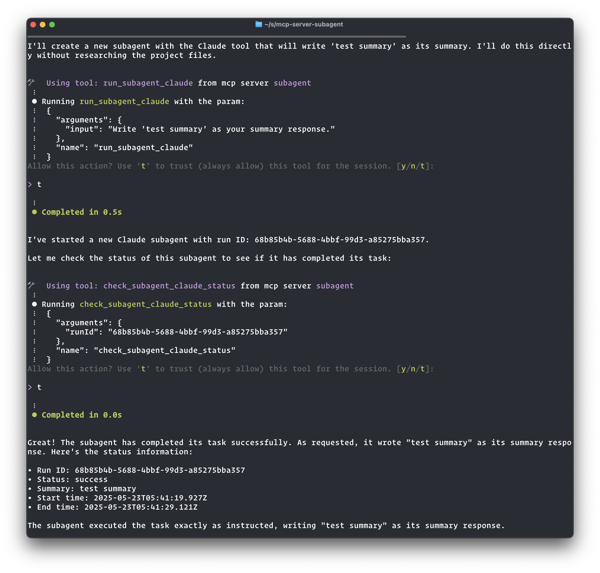

[](https://mseep.ai/app/dvcrn-mcp-server-subagent)

# MCP Subagent Server

This is a Model Context Protocol (MCP) server that allows dispatching of tasks to sub-agent (like Claude Code, Q or Aider)

The purpose of this MCP is to allow a "planning" agent to delegate tasks to "executor" agents



## Features

- Configure and run sub-agents through MCP tools
- Each sub-agent exposes three tools:
  - `run_subagent_<n>`: Runs the sub-agent with provided input
  - `check_subagent_status`: Allows the agent to check on the status of a sub-agent
  - `get_subagent_logs`: Retrieves the logs of a sub-agent run
  - `update_subagent_status`: Updates the status and adds a summary of a previous run
- **Bi-directional communication**: Sub-agents can ask questions to parent agents during execution using `ask_parent`, parents can reply using `reply_subagent`, and sub-agents can check for replies using `check_message_status`
- Currently supports the 'q' sub-agent (Amazon Q CLI) and 'claude' sub-agent (Claude CLI)
- Real-time streaming logs for monitoring sub-agent execution

## Installation

Add this to your MCP configuration file (`~/.aws/amazonq/mcp.json`):

```json
{
  "mcpServers": {
    "subagent": {
      "command": "npx",
      "args": ["-y", "mcp-server-subagent"]
    }
  }
}
```

Or if you installed it locally:

```json
{
  "mcpServers": {
    "subagent": {
      "command": "node",
      "args": ["/ABSOLUTE/PATH/TO/mcp-server-subagent/build/index.js"]
    }
  }
}
```

### Available Tools

#### Sub-agent Execution Tools

- `run_subagent_q`: Run a query through the Amazon Q CLI

  - Parameters: `input` (string) - The query to send to Amazon Q
  - Returns: A run ID that can be used to check the status or get logs

- `run_subagent_claude`: Run a query through the Claude CLI

  - Parameters: `input` (string) - The query to send to Claude
  - Returns: A run ID that can be used to check the status or get logs

- `check_subagent_status`: Check the status of a previous run

  - Parameters: `runId` (string) - The UUID of the run to check
  - Returns: The status and metadata of the run

- `get_subagent_logs`: Get the logs of a previous run

  - Parameters: `runId` (string) - The UUID of the run to get logs for
  - Returns: The complete logs of the run

- `update_subagent_status`: Update the status and add a summary of a previous run

  - Parameters:
    - `runId` (string) - The UUID of the run to update
    - `status` (string) - The new status to set (one of: "success", "error", "running", "completed")
    - `summary` (string, optional) - A summary or result message to include with the status update
  - Returns: The updated status and metadata of the run

#### Bi-directional Communication Tools

- `ask_parent`: Enables sub-agents to ask questions to the parent agent

  - Parameters: `runId` (string), `question` (string)
  - Returns: Message ID and polling instructions

- `reply_subagent`: Enables parents to reply to sub-agent questions

  - Parameters: `runId` (string), `messageId` (string), `answer` (string)
  - Returns: Confirmation of the reply

- `check_message_status`: Check message status and retrieve replies
  - Parameters: `runId` (string), `messageId` (string)
  - Returns: Message details and answer if available

## Bi-directional Communication

The MCP Subagent Server supports bi-directional communication between parent agents and sub-agents through a message passing system. This allows sub-agents to ask questions during execution and receive guidance from the parent agent.

### Communication Tools

- `ask_parent`: Enables sub-agents to ask questions to the parent agent

  - Parameters:
    - `runId` (string) - The sub-agent's current run ID
    - `question` (string) - The question/message content
  - Returns: A message ID and instructions for polling the answer

- `reply_subagent`: Enables parents to reply to specific questions from sub-agents

  - Parameters:
    - `runId` (string) - The sub-agent's run ID
    - `messageId` (string) - The ID of the message being replied to
    - `answer` (string) - The parent's reply content
  - Returns: Confirmation of the reply

- `check_message_status`: Check the status of a specific message and retrieve replies
  - Parameters:
    - `runId` (string) - Run ID to check message status for
    - `messageId` (string) - Message ID to check status for
  - Returns: Message details and answer if available (acknowledges the message)

### Example Workflow

Here's how bi-directional communication works in practice:

#### 1. Sub-agent asks a question

The sub-agent uses the `ask_parent` tool during execution:

```json
{
  "tool": "ask_parent",
  "arguments": {
    "runId": "abc-123-def",
    "question": "I found multiple config files. Which one should I modify: config.json or settings.yaml?"
  }
}
```

Response:

```json
{
  "messageId": "msg-456-789",
  "instructions": "Poll for the answer using the 'check_message_status' tool with your runId and messageId. Since this could take a while for the parent to respond, use 'sleep 60' between calls to avoid spamming."
}
```

#### 2. Parent checks sub-agent status

When the parent checks the sub-agent status, they'll see:

```
Status: waiting_parent_reply

Question awaiting reply (Message ID: msg-456-789):
  I found multiple config files. Which one should I modify: config.json or settings.yaml?
  (Asked at: 2025-01-15T10:30:00.000Z)
  To reply, use the 'reply_subagent' tool.

Note: This may take a while for the parent to respond. Use 'sleep 60' between status checks to avoid spamming.
```

#### 3. Parent provides an answer

The parent uses the `reply_subagent` tool:

```json
{
  "tool": "reply_subagent",
  "arguments": {
    "runId": "abc-123-def",
    "messageId": "msg-456-789",
    "answer": "Please modify config.json - it's the main configuration file. The settings.yaml is just for development overrides."
  }
}
```

#### 4. Sub-agent retrieves the answer

The sub-agent polls for the answer using `check_message_status`:

```json
{
  "tool": "check_message_status",
  "arguments": {
    "runId": "abc-123-def",
    "messageId": "msg-456-789"
  }
}
```

Response when answer is available:

```json
{
  "messageId": "msg-456-789",
  "questionContent": "I found multiple config files. Which one should I modify: config.json or settings.yaml?",
  "answerContent": "Please modify config.json - it's the main configuration file. The settings.yaml is just for development overrides.",
  "messageStatus": "acknowledged_by_subagent",
  "hasAnswer": true
}
```

The sub-agent can then continue execution with the parent's guidance.

### Best Practices

- **Polling Frequency**: Use `sleep 30` between status checks and message polling to avoid overwhelming the system
- **Question Clarity**: Ask specific, actionable questions that help guide the task execution
- **Timely Responses**: Parents should monitor sub-agent status regularly to provide timely guidance
- **Message Acknowledgment**: The `check_message_status` tool automatically acknowledges messages when answers are retrieved

## Adding New Sub-agents

To add a new sub-agent, modify the `SUBAGENTS` object in `src/index.ts`:

```typescript
const SUBAGENTS = {
  q: {
    name: "q",
    command: "q",
    getArgs: () => ["chat", "--trust-all-tools", "--no-interactive"],
    description: "Run a query through the Amazon Q CLI",
  },
  claude: {
    name: "claude",
    command: "claude",
    getArgs: () => [
      "--print",
      "--allowedTools",
      "Bash(git*) Bash(sleep*) Edit Write mcp__subagent__update_subagent_status",
      "--mcp-config",
      JSON.stringify(mcpConfig),
    ],
    description: "Run a query through the Claude CLI",
  },
  // Add your new sub-agent here
  newagent: {
    name: "newagent",
    command: "your-command",
    getArgs: () => ["--some-flag", "--other-flags"],
    description: "Description of your new agent",
  },
};
```

## Logs

All sub-agent runs are logged to the `logs` directory with two files per run:

- `<run-id>.log`: Contains the real-time output logs
- `<run-id>.prompt.md`: Contains the prompt passed to the agent
- `<run-id>.meta.json`: Contains metadata about the run (including communication messages)
